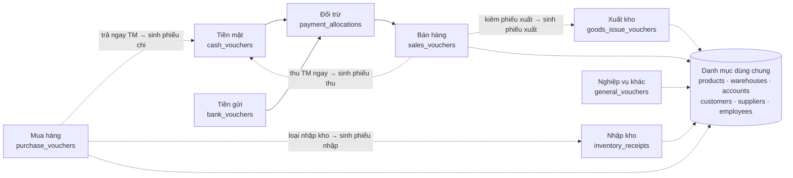
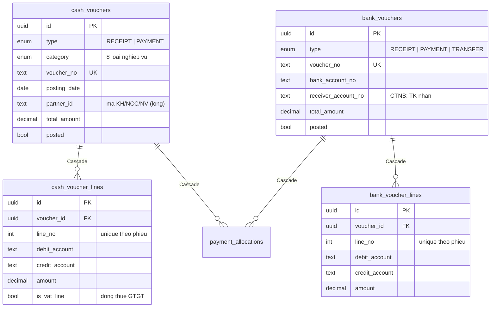
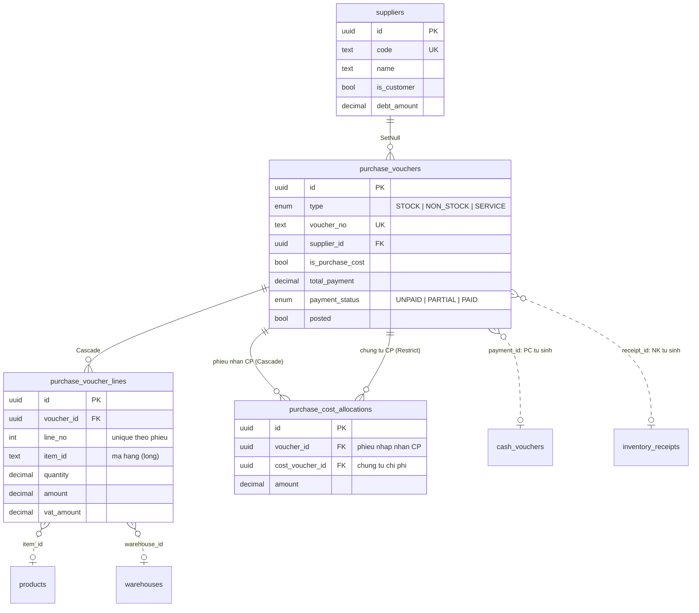
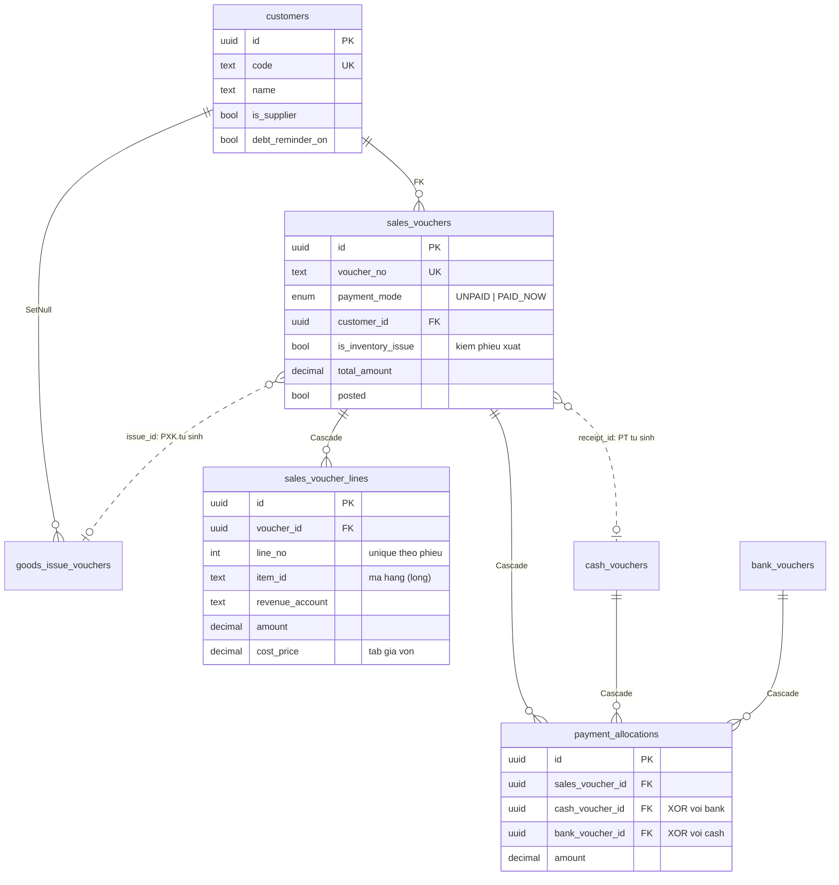
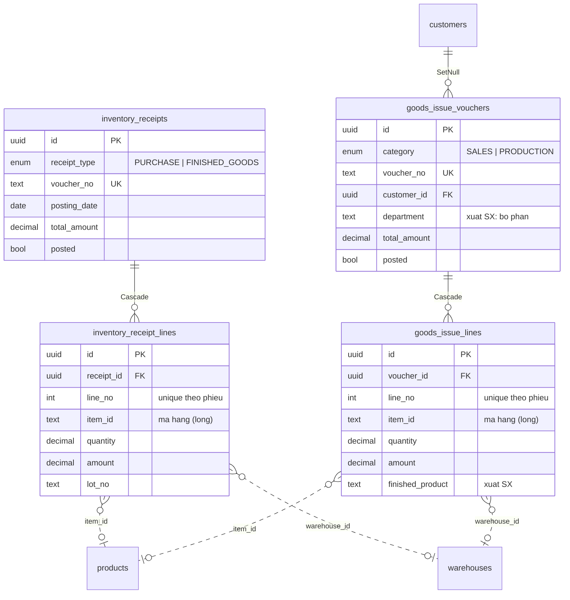
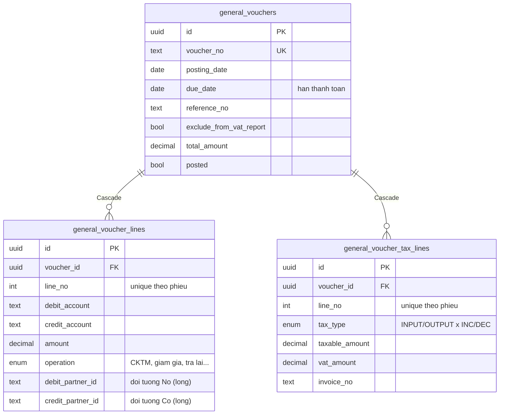
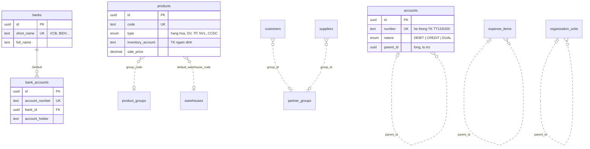
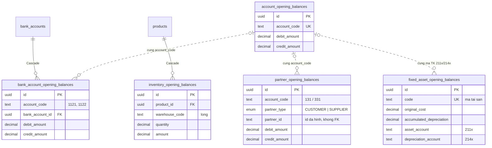

# Sơ đồ cơ sở dữ liệu

Toàn bộ schema Postgres của phần mềm, sinh từ [`apps/api/prisma/schema.prisma`](../apps/api/prisma/schema.prisma) — nhóm theo phân hệ nghiệp vụ. Mỗi chứng từ = 1 header + nhiều dòng bút toán kép (Nợ/Có).

**42 bảng · 28 enum · PostgreSQL/Prisma · migration `20260812000000_init` · tiền = `NUMERIC(18,2)`**

Quy ước vẽ:

- **Nét liền** = FK thật (ràng buộc DB, kèm hành vi Cascade/SetNull/Restrict)
- **Nét đứt** = tham chiếu lỏng (theo mã hiển thị, không FK)

## Tổng quan — luồng chứng từ giữa các phân hệ

Chứng từ mua/bán tự sinh chứng từ tiền và kho (tham chiếu lỏng `payment_id` / `receipt_id` / `issue_id`). Thu tiền sau đối trừ qua `payment_allocations`. Sổ sách/báo cáo union 7 bảng dòng bút toán; chứng từ `posted = false` bị loại khỏi sổ.

## Tiền mặt & tiền gửi (`cash` · `bank`)

Phiếu thu/chi (PT/PC) và thu tiền gửi/UNC/chuyển tiền nội bộ (NTTK/UNC/CTNB). Dòng thuế GTGT của phiếu chi là bút toán thật (`is_vat_line`, Nợ 1331). Chuyển tiền nội bộ (TRANSFER) tách 2 đầu TK trên báo cáo.

## Mua hàng (`purchase`)

Ba loại: nhập kho / không qua kho / dịch vụ. Chứng từ dịch vụ đánh dấu `is_purchase_cost` mới được đem phân bổ chi phí vào phiếu nhập kho (§10.4). Xóa chứng từ chi phí đang được phân bổ bị chặn (Restrict) — tránh âm thầm đổi giá trị nhập kho của phiếu khác.

## Bán hàng & đối trừ công nợ (`sales`)

Hai chứng từ: chưa thu tiền (BH) và thu tiền mặt ngay (PT tự sinh). Thu tiền sau đối trừ qua `payment_allocations` — trạng thái thanh toán = tổng phân bổ so với tổng tiền. CHECK `payment_allocations_source_xor`: đúng 1 trong 2 nguồn tiền (phiếu thu TM hoặc thu tiền gửi). Cascade cả 3 phía — xóa chứng từ nào đối trừ cũng tự mất.

## Kho — nhập & xuất (`inventory`)

Nhập kho: mua hàng / thành phẩm sản xuất. Xuất kho: bán hàng / sản xuất (nguyên vật liệu gắn `finished_product`). Line ghi cặp TK Nợ/Có riêng. Báo cáo tồn kho lọc trực tiếp trên bảng line qua index `(item_id, warehouse_id)`.

## Chứng từ nghiệp vụ khác (`general`)

Bút toán tự do: hàng về trước hóa đơn về sau, giải ngân vay, bù trừ công nợ… Đối tượng tách theo vế Nợ / vế Có. Dòng kê khai thuế **chỉ** phục vụ bảng kê GTGT, không sinh bút toán (khác phân hệ tiền mặt: bút toán thuế NVK do người dùng tự nhập ở tab Hạch toán).

## Danh mục dùng chung (`catalog`)

Chứng từ tham chiếu danh mục chủ yếu bằng **mã** (tham chiếu lỏng). FK thật giữa danh mục: duy nhất Bank ← BankAccount (SetNull — xóa ngân hàng không mất tài khoản). Phân cấp cha–con qua `parent_id` tự trỏ.

Các bảng danh mục còn lại (đứng độc lập, cờ `is_active` thay xóa cứng):

| Bảng | Vai trò | Khóa tự nhiên |
| --- | --- | --- |
| `warehouses` | Kho | `code` |
| `employees` | Nhân viên | `code` |
| `partner_groups` / `product_groups` | Nhóm KH-NCC / nhóm VTHH | `code` |
| `expense_items` | Khoản mục chi phí (cây) | `code` |
| `cost_objects` | Đối tượng tập hợp chi phí | `code` |
| `income_expense_items` | Mục thu/chi dòng tiền | `code` |
| `transfer_accounts` | Kết chuyển cuối kỳ (511-911…) | `code` |
| `default_accounts` | Cặp TK Nợ/Có ngầm định theo nghiệp vụ | — |
| `voucher_types` | Loại chứng từ (PT, PC…) | `code` |
| `units` | Đơn vị tính | `name` |
| `organization_units` | Cơ cấu tổ chức (cây 3 cấp) | `code` |
| `users` | Người dùng — RBAC 4 vai trò (ADMIN/KETOAN/THUQUY/VIEWER) | `email` |
| `book_locks` | Khóa sổ kỳ kế toán (1 dòng duy nhất, id = 1) | — |

## Số dư đầu kỳ (`opening-balance`)

5 bảng khai báo trước ngày bắt đầu hạch toán. TK tổng trong `account_opening_balances` = tổng các dòng chi tiết cùng mã TK ở bảng con tương ứng. `partner_opening_balances` đa hình theo `partner_type` — không FK cứng vì đối tượng nằm ở 2 bảng customers/suppliers.

## Quy ước xuyên suốt schema

- **Header + lines** — mỗi chứng từ 1 header + n dòng bút toán kép; `@@unique(voucher_id, line_no)` chặn trùng số dòng. Update = xóa hết line cũ tạo lại trong `$transaction`.
- **Ghi sổ / bỏ ghi** — cờ `posted` trên mọi header; bỏ ghi là loại khỏi sổ/báo cáo, không xóa cứng dữ liệu.
- **Tiền = Decimal** — mọi cột tiền `NUMERIC(18,2)`, số lượng `NUMERIC(18,4)`, không float. DTO serialize `.toString()`.
- **Mã vs. row id** — cột đối tượng trên chứng từ (`partner_id`, `item_id`…) lưu **mã** hiển thị (tham chiếu lỏng); FK thật (uuid) chỉ ở các quan hệ vẽ nét liền.
- **Số chứng từ** — `voucher_no` unique, tự tăng theo `MAX(seq trong năm) + 1`, không dùng count+1.
- **Audit** — mọi bảng có `created_at` / `updated_at`, đa số kèm `created_by`; danh mục dùng cờ `is_active` thay xóa cứng.

Lưu ý: mỗi entity trong diagram chỉ liệt kê cột chủ chốt (PK/FK + trường nghiệp vụ chính). Schema đầy đủ xem `apps/api/prisma/schema.prisma`.
